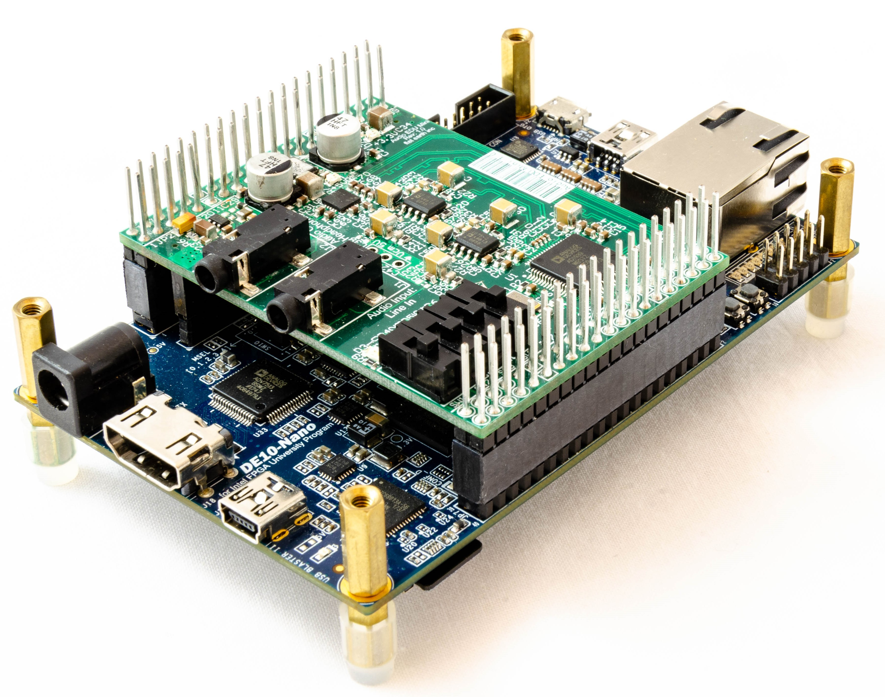

# SoC FPGA Open Audio Processing Poster
A poster presentation for the AES 147 paper [An Open Audio Processing Platform Using SoC FPGAs and Model-Based Development](http://www.aes.org/e-lib/browse.cfm?elib=20623). 

## Streamlining the creation of low-latency FPGA-based signal processing applications
FPGAs are good at low-latency, high performance signal processing, but implementing algorithms on FPGAs is time consuming and requires significant hardware and software expertise. The goal of this research is to make the development process more accessible by providing open-source tools that automate as much of the process as possible. This is achieved through the use of model-based development and automatic code generation

## Hardware platform
In addition to software tooling, we have developed an open source audio daughter card for the [DE10 Nano development board](https://www.terasic.com.tw/cgi-bin/page/archive.pl?Language=English&No=1046).
